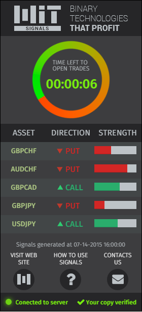

# MiTsignals
## MITsignals project main interface
 Five hours, use HTML5, SCSS(CSS3),Jquery, Font Awesome, Bootstrap...
 
 What we have as prototype?
 
 
 
 OK!
 
 I started with Yii framework(we use it in our projects)... made landing, routing, bla-bla-bla...
 
 You can see the result in [interface preview page](index.php)  
 

