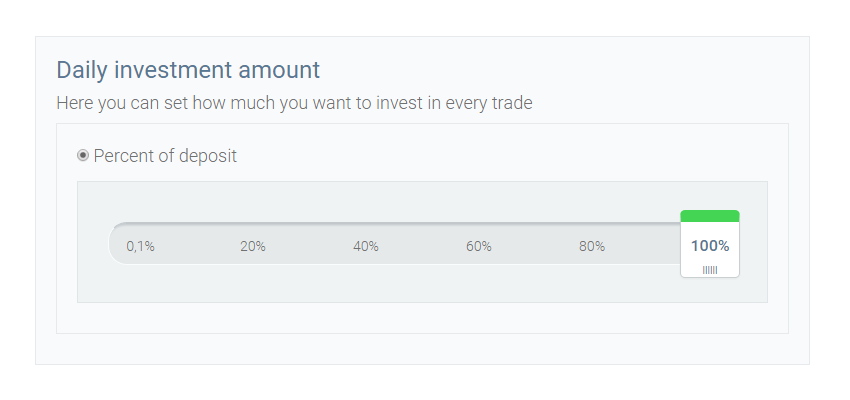

# Bootstrap Slider Daily Investment interface
## Styled Bootstrap Slider Investment interface with cool tracker

 The task is: to make a styled bootstrap slider with cool navigation....

 I used:
  [Bootstrap](http://getbootstrap.com)
  [Bootstrap Slider](https://github.com/seiyria/bootstrap-slider)

 Thank You for all!

 There is not enough to close my task use standard plugins and options(like every time)...

 I need to change the styles and to combine all of them in one plugin...

 OK!

 I use SCSS for my style. But you can see CSS file only if you need.

 I blocked(some classes) standard Bootstrap CSS and change it in my SCSS file...

 DONE!

 You can see the working version in index.php file.

 Now this calculator located in some our interfaces.

 But it is not responsive...  sorry! No task... not done.

 Look`s same like this:

 