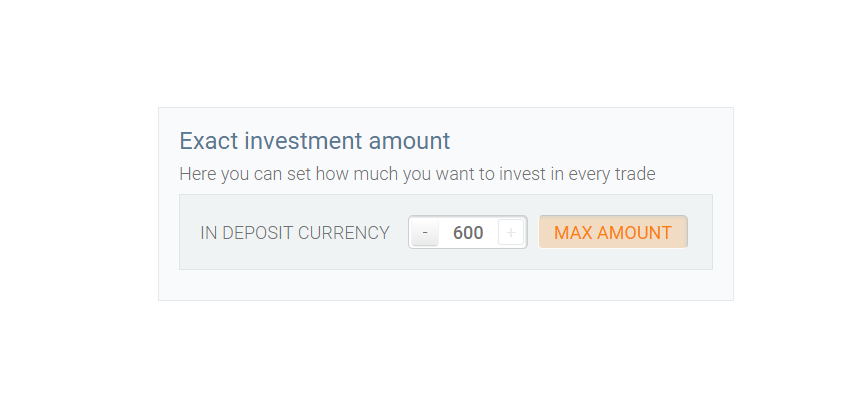
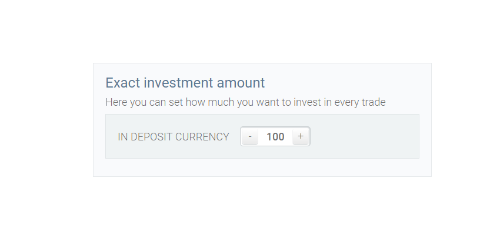

 # Exact Investment interface
 ## Styled Exact Investment interface with minimal and maximum alert label

  The task is: to make a styled interface use plus(+) and minus(-). Minimal and maximum alert label needed...

  I used:
   [Bootstrap](http://getbootstrap.com) - for styles(for our big project)
   [Jquery](https://ajax.googleapis.com/ajax/libs/jquery/1.11.3/jquery.min.js) - by Google library

  Thank You for all!

  I use some styles and jquery code for my task...
  OK!

  You can see SCSS for my style. But you can see CSS file only if you need.

 If You select minimal amount, You can see the minimal alert

 

 If You select maximum amount, You can see the maximum alert

 

  DONE!

  You can see the working version in index.php file.

  Now this small interface is located in some our interfaces.

  But it is not responsive...  sorry! No task... not done.

  Look`s same like this:

  

